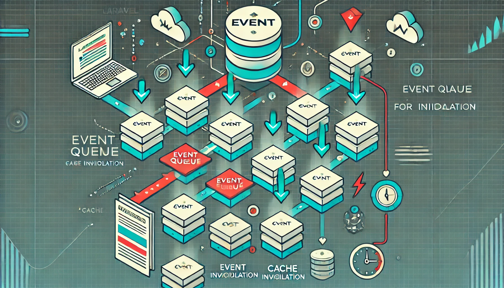
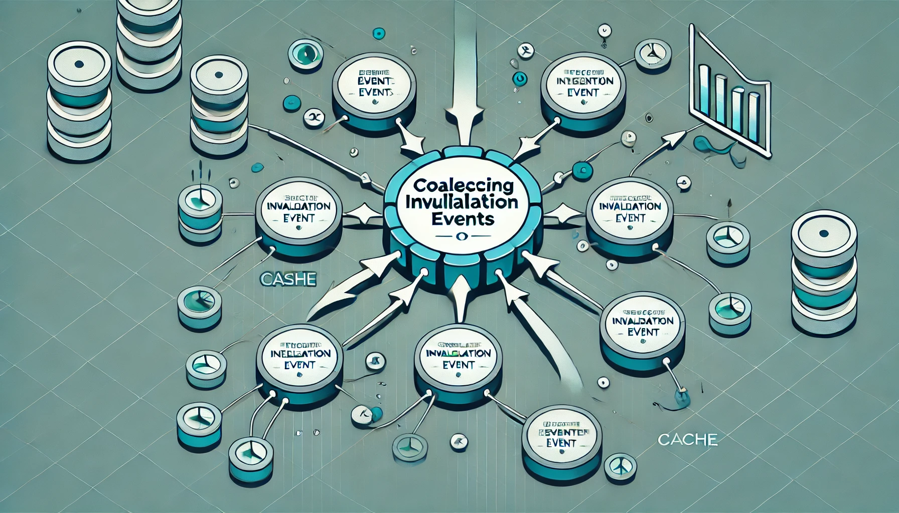
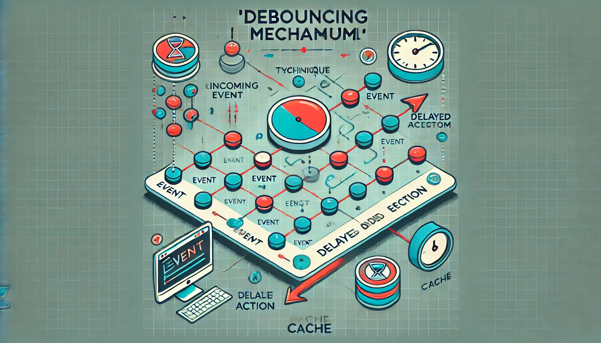
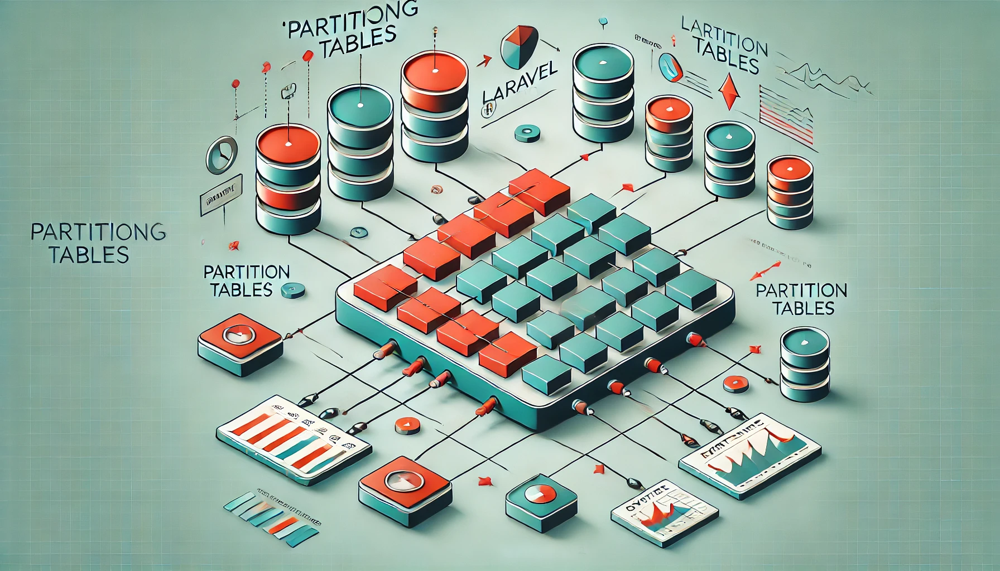

# Laravel Super Cache Invalidate


**Laravel Super Cache Invalidate** is a powerful package that provides an efficient and scalable cache invalidation system for Laravel applications. It is designed to handle high-throughput cache invalidation scenarios, such as those found in e-commerce platforms, by implementing advanced techniques like event queuing, coalescing, debouncing, sharding, and partitioning.

[](https://packagist.org/packages/padosoft/laravel-super-cache-invalidate)
[](LICENSE.md)
[](https://circleci.com/gh/padosoft/laravel-super-cache-invalidate)
[](https://scrutinizer-ci.com/g/padosoft/laravel-super-cache-invalidate)
[](https://packagist.org/packages/padosoft/laravel-super-cache-invalidate)

## Table of Contents

- [Introduction](#introduction)
- [Features](#features)
- [Requires](#requires)
- [Installation](#installation)
- [Configuration](#configuration)
- [Usage](#usage)
    - [Inserting Invalidation Events](#inserting-invalidation-events)
    - [Processing Invalidation Events](#processing-invalidation-events)
    - [Pruning Old Data](#pruning-old-data)
- [Architecture and Techniques](#architecture-and-techniques)
    - [Event Queue for Cache Invalidation](#event-queue-for-cache-invalidation)
    - [Coalescing Invalidation Events](#coalescing-invalidation-events)
    - [Debouncing Mechanism](#debouncing-mechanism)
    - [Handling Associated Identifiers During Invalidation](#handling-associated-identifiers-during-invalidation)
    - [Sharding and Parallel Processing](#sharding-and-parallel-processing)
    - [Partitioning Tables](#partitioning-tables)
    - [Semaphore Locking with Redis](#semaphore-locking-with-redis)
- [More in depth](#more-in-depth)
    - [Event Queue for Cache Invalidation in Depth](#event-queue-for-cache-invalidation-in-depth)
    - [Coalescing Invalidation Events in Depth](#coalescing-invalidation-events-in-depth)
    - [Debouncing Mechanism in Depth](#debouncing-mechanism-in-depth)
    - [Handling Associated Identifiers During Invalidation in Depth](#handling-associated-identifiers-during-invalidation-in-depth)
    - [Sharding and Parallel Processing in Depth](#sharding-and-parallel-processing-in-depth)
    - [Partitioning Tables in Depth](#partitioning-tables-in-depth)
    - [Semaphore Locking with Redis in Depth](#semaphore-locking-with-redis-in-depth)
- [Performance Optimizations](#performance-optimizations)
- [Testing](#testing)
- [Contributing](#contributing)
- [License](#license)

## Introduction

In high-traffic applications, especially e-commerce platforms, managing cache invalidation efficiently is crucial. Frequent updates from various sources like ERP systems, warehouses, backoffice tools, and web orders can lead to performance bottlenecks if not handled properly. This package provides a robust solution by implementing advanced cache invalidation strategies.

## Features

- **Asynchronous Event Queue**: Collect and process cache invalidation requests asynchronously.
- **Coalescing and Debouncing**: Merge multiple invalidation events and prevent redundant invalidations.
- **Sharding**: Distribute events across shards for parallel processing.
- **Partitioning**: Use MySQL partitioning for efficient data management and purging.
- **Semaphore Locking**: Prevent overlapping processes using Redis locks.
- **Customizable**: Configure invalidation windows, shard counts, batch sizes, and more.
- **High Performance**: Optimized for handling millions of events with minimal overhead.

## Requires

- php: >=8.0
- illuminate/database: ^9.0|^10.0|^11.0
- illuminate/support:  ^9.0|^10.0|^11.0


## Installation

Install the package via Composer:

```bash
composer require padosoft/laravel-super-cache-invalidate
```
Publish the configuration and migrations:

```bash
php artisan vendor:publish --provider="Padosoft\SuperCacheInvalidate\SuperCacheInvalidationServiceProvider"
```

Run migrations:

```bash
php artisan migrate
```

## Configuration
The package configuration file is located at config/super_cache_invalidate.php. 
You can adjust the settings to suit your application's needs:
```php
return [
    'total_shards' => 10,
    'invalidation_window' => 60,
    'processing_limit' => 10000,
    'tag_batch_size' => 100,
    'lock_timeout' => 600,
    'key_invalidation_callback' => null,
    'tag_invalidation_callback' => null,
];
```


## Usage

### Inserting Invalidation Events
Use the SuperCacheInvalidationHelper to insert invalidation events:
```php
use Padosoft\SuperCacheInvalidate\Helpers\SuperCacheInvalidationHelper;

$helper = app(Padosoft\SuperCacheInvalidate\Helpers\SuperCacheInvalidationHelper::class);

// Invalidate a tag
$helper->insertInvalidationEvent('tag', 'category:sport', 'Product updated in category sport');

// Invalidate a key
$helper->insertInvalidationEvent('key', 'cache_key_xyz', 'Specific cache key invalidated');

// Invalidate a key with associated tags
// In this example, when the event for article_ID:7 is processed,
// it will also consider plp:sport during invalidation.
// If plp:sport is within its invalidation window, the invalidation of article_ID:7
// will be deferred to ensure consistency.
$helper->insertInvalidationEvent(
    'tag',
    'article_ID:7',
    'Article 7 removed from sale',
    0,
    [
        ['type' => 'tag', 'identifier' => 'plp:sport']
    ]
);
```


### Processing Invalidation Events
Schedule the processing command to run at desired intervals:

```bash
php artisan supercache:process-invalidation --shard=0 --priority=0
```

You can add it to your schedule method in App\Console\Kernel.php:

```php
$schedule->command('supercache:process-invalidation --shard=0 --priority=0')->everyMinute();
```

### Pruning Old Data
Schedule the pruning command to remove old data:

```bash
php artisan supercache:prune-invalidation-data --months=1
```

## Architecture and Techniques

### Implement an Event Queue for Cache Invalidation


**Why:** An event queue allows you to collect and process cache invalidation requests asynchronously. 
It serves as a buffer between the producers of invalidation events (ERP, warehouse, backoffice, web orders) and the cache invalidation logic.

### Coalesce Invalidation Events with MySQL


**Why:** Coalescing helps to merge multiple invalidation events for the same identifier within a specific time window, reducing redundant invalidations.
- **Separate Records per Event:** Each invalidation event creates a separate record, allowing for event history tracking and effective coalescing during processing.

### Implement Debouncing Mechanism


**Why:** Debouncing prevents the same invalidation from being processed repeatedly in rapid succession.
- **Track Last Invalidation Time:** For each identifier, store the timestamp of the last invalidation.
- **Set a Minimum Interval:** Define a minimum time interval (invalidation window) before the same identifier can be invalidated again.
- **Ensuring Cache Invalidation After the Time Window:**
  - Mark all events in the group as processed except for the last one when skipping invalidation.
  - Leave the last event unprocessed to trigger invalidation after the window if no new events arrive.

### Handling Associated Identifiers During Invalidation


**Why:** In complex scenarios, invalidating a cache key or tag may depend on other related tags. For example, when an article is removed from sale, you might need to invalidate both the article's cache and any category pages that include it.
**Solution:**
- **Association Mechanism:** You can specify associated identifiers (keys or tags) when inserting an invalidation event. These associations ensure that all related cache entries are considered during invalidation.
- **Integrated Processing:** Modify the event processing logic to consider both the main identifier and its associated identifiers when deciding whether to invalidate.
- **Processing Logic:** When processing events, the system checks the invalidation window for both the main identifier and any associated identifiers. If any are within the invalidation window, the invalidation is deferred to prevent inconsistent cache states.
- **Consistency Check:** During invalidation, if any associated identifiers are within the invalidation window, the entire group is deferred to maintain consistency.

**Implementation:**

- **Associations at Insertion:** When inserting an invalidation event, provide an optional array of associated identifiers.
- **Event Processing Adjustments:** Fetch associated identifiers and include them in the invalidation checks and updates.

**Benefits:**
- **Consistency:** Prevents scenarios where some cache entries are updated while related ones are not, avoiding issues like 404 errors or displaying outdated data.
- **Flexibility:** Allows you to model complex invalidation dependencies according to your application's needs.
- **Customizable Dependencies:** Allows defining complex relationships between cache entries based on application logic.

### Sharding and Parallel Processing


**Enhancing Parallel Processing with Sharding:**

- **Shard Calculation:** Use a hash function to calculate the shard number based on the identifier, ensuring even distribution.
- **Partitioning by Shard:** Physically partition tables based on the shard column for improved query performance.
- **Process Configuration:** Assign worker processes to specific shards for parallel processing.
- **Configurable Shard Count:** Adjust the number of shards to balance parallelism and overhead.

## Partitioning Tables


**Why:** Partitioning improves performance and manageability, especially for large tables.

- **Partitioning Strategy:** Use generated columns to partition tables based on date components and other factors.
- **Efficient Purging:** Drop entire partitions to remove old data quickly.

**Semaphore Locking with Redis**
Implementing Semaphores to Prevent Overlapping:

**Why:** Prevent multiple processes from processing the same shard simultaneously.
**How:**
- Use Redis to implement distributed locks with TTL.
- Ensure only the lock owner can release it by comparing the lock value.

## Performance Optimizations

- **Efficient Queries:** Optimize queries by using composite indexes and avoiding N+1 query problems.
- **Batch Processing:** Process identifiers in batches to reduce overhead.
- **Avoiding Redundant Invalidations:** Implement coalescing and debouncing to minimize unnecessary cache operations.
- **Partitioning:** Use partitioning to improve query performance and enable efficient data purging.


## More in depth

### Event Queue for Cache Invalidation in Depth
In modern, high-traffic applications—especially those in the e-commerce sector—the rate at which data changes can be overwhelming. 
Products go out of stock, prices fluctuate, new items are added, and descriptions are updated. 
These changes often originate from multiple sources such as ERP systems, warehouse updates, backoffice operations, and customer activities like web orders.
Each of these changes necessitates updating or invalidating cache entries to ensure that users always see the most current information.

**Purpose and Advantages**
An Event Queue for Cache Invalidation serves as an intermediary layer that collects all cache invalidation requests and processes them asynchronously. 
This mechanism provides several significant benefits:

1. **Decoupling Producers and Consumers:**

- **Producers:** Systems that generate invalidation events (e.g., ERP updates, warehouse systems).
- **Consumers:** The cache invalidation logic that processes these events.
- By decoupling these two, we prevent the producers from being directly tied to the potentially time-consuming invalidation process, enhancing overall system responsiveness.
- 
2. **Asynchronous Processing:**
- Events are queued and processed separately from the main application flow.
- This ensures that user-facing operations are not delayed due to cache invalidation tasks, providing a smoother user experience.

3. **Load Management:**
- Smooths out spikes in invalidation events by processing them at a manageable rate.
- Prevents system overload during peak times when numerous updates might occur simultaneously.

4. **Event Coalescing and Debouncing:**
- Enables grouping multiple invalidation requests for the same cache entry within a specific time window.
- Reduces redundant work by avoiding multiple invalidations of the same cache entry in quick succession.

5. **Historical Logging:**
- Maintains a complete record of all invalidation events.
- Facilitates auditing, debugging, and analyzing patterns in data changes and cache usage.

**Problems Without an Event Queue**
Without employing an event queue for cache invalidation, applications may face several challenges:

- **Immediate Processing Overhead:**
  - Each invalidation request triggers an immediate cache invalidation.
  - High-frequency updates can overwhelm the cache system, leading to performance degradation.

- **Redundant Invalidations:**
  - Multiple systems might invalidate the same cache entry repeatedly in a short period.
  - This results in unnecessary cache misses and increased load on the database.

- **Synchronous Blocking:**
  - Producers are forced to wait until cache invalidation is complete.
  - This can slow down operations like order processing or product updates, negatively impacting user experience.

- **Lack of Visibility:**
  - Without logging invalidation events, it's difficult to troubleshoot cache-related issues.
  - Understanding the history of changes becomes challenging, hindering optimization efforts.

**Conceptual Examples**
**Scenario 1: E-commerce Product Updates**

- **Context:** An online store has thousands of products. Inventory levels and prices are updated frequently throughout the day.
- **Without Event Queue:**
  - Each inventory or price update triggers immediate cache invalidation.
  - During peak times, the cache system is bombarded with invalidations, causing slowdowns.

- **With Event Queue:**
  - Updates are queued and processed asynchronously.
  - Cache invalidations are coalesced, so each product's cache is invalidated only once within the specified time window.
  - The main application remains responsive, and the cache system operates efficiently.

**Scenario 2: Content Management System (CMS) Publishing**

- **Context:** Editors frequently update articles, sometimes making multiple edits in quick succession.
- **Without Event Queue:**
  - Every save action invalidates the cache for that article.
  - Readers might experience slower page loads due to frequent cache misses.

- **With Event Queue:**
  - Edits are collected, and the cache is invalidated after the editor has finished making changes.
  - Readers benefit from faster load times, and system resources are conserved.

**Choice of MySQL for the Event Queue**
We selected MySQL as the underlying storage mechanism for the event queue due to several practical reasons:

**- Familiarity and Accessibility:**
  - MySQL is widely used and well-understood in the development community.
  - Teams are more likely to have existing expertise, reducing the learning curve.

- **Transactional Integrity:**
  - Provides strong ACID (Atomicity, Consistency, Isolation, Durability) properties.
  - Ensures that invalidation events are recorded and processed reliably.

- **Ease of Integration:**
  - Seamlessly integrates with Laravel's Eloquent ORM and query builder.
  - Simplifies development and maintenance efforts.
  
- **Sufficient Performance for Many Use Cases:**
  - Capable of handling a substantial number of invalidation events efficiently, especially when optimized with indexing and partitioning.

**Alternatives and Complexity Considerations**
In scenarios where the volume of events is extraordinarily high, or where more advanced streaming capabilities are required, 
other technologies might be considered:

- **Message Brokers (e.g., RabbitMQ, Apache ActiveMQ):**
  - Designed for high-throughput messaging between systems.
  - Introduce additional infrastructure and complexity.
  - Require handling message delivery guarantees, ordering, and potential retries.

- **Streaming Databases and Platforms (e.g., Apache Kafka with KSQL):**
  - **Kafka** is built for handling real-time data feeds and can process millions of messages per second.
  - **KSQL** enables real-time stream processing and materialized views.
  - Offers powerful features like windowing, joining streams, and more.
  - **Complexity Trade-Offs:**
    - Significant operational overhead in setting up and maintaining Kafka clusters.
    - Requires specialized knowledge to develop and manage stream processing applications.
    - Might be overkill for applications where MySQL can adequately handle the event volume.

**Why MySQL Is Often Sufficient**
- For many applications, the rate of cache invalidation events is within the capabilities of a well-optimized MySQL database.
- Using MySQL avoids the need to introduce and maintain additional systems, keeping the architecture simpler and more manageable.
- The built-in features of MySQL, such as indexing, partitioning, and transaction support, can be leveraged to achieve the necessary performance.

**Conclusion**
Implementing an **Event Queue for Cache Invalidation** using MySQL strikes a balance between functionality and complexity. 
It provides the necessary features to handle cache invalidation efficiently in most scenarios while keeping the system architecture straightforward. 
By addressing the challenges of immediate processing overhead, redundant invalidations, and lack of visibility, this technique ensures that applications remain performant and maintain a high-quality user experience.

However, it's essential to assess the specific needs of your application. 
For extremely high-volume systems or those requiring advanced streaming capabilities,
exploring alternative technologies like Kafka might be warranted, despite the increased complexity.

### Coalescing Invalidation Events in Depth

In applications where data changes rapidly and frequently, managing cache invalidation efficiently becomes a significant challenge. 
**Coalescing Invalidation Events** is a technique designed to address this challenge by grouping multiple invalidation requests for the same cache key or tag within a specified time window. 
This approach reduces redundant cache invalidations, optimizes resource utilization, and improves overall system performance.

**Purpose and Advantages**
1. **Reduction of Redundant Invalidations:**

- **Purpose:** To prevent the system from performing unnecessary cache invalidations when multiple updates to the same data occur in quick succession.
- **Advantage:** By consolidating multiple invalidation events into a single action, the system minimizes the overhead associated with cache invalidation processes, leading to better performance.

2. **Optimized Resource Utilization:**

- **Purpose:** To conserve computational resources such as CPU cycles, memory, and I/O operations by avoiding repetitive tasks.
- **Advantage:** Reducing the frequency of cache invalidations lessens the load on the database and application servers, enabling them to serve more user requests efficiently.


3. **Improved Cache Efficiency:**

- **Purpose:** To maintain higher cache hit rates by ensuring that cached data remains valid for longer periods.
- **Advantage:** With fewer invalidations, the cache serves more requests, resulting in faster response times and a better user experience.

4. **Smoothing of Load Spikes:**

- **Purpose:** To prevent sudden spikes in system load caused by bursts of invalidation events.
- **Advantage:** Coalescing evens out the processing load, ensuring that the system remains stable and responsive even during peak activity periods.

**Problem Without This Technique**
Without coalescing invalidation events, systems may encounter several issues:

1. **Cache Thrashing:**

- **Issue:** The cache is invalidated so frequently that it becomes ineffective, with most requests resulting in cache misses.
- **Impact:** The benefits of caching are negated, leading to increased latency as the system must regenerate content or fetch data from the database for each request.

2. **Increased Backend Load:**

- **Issue:** Frequent invalidations cause a surge in database queries and computations as the system rebuilds cache entries.
- **Impact:** This can overwhelm the backend infrastructure, leading to slower response times or even system outages.

3. **Inefficient Use of Resources:**

- **Issue:** The system wastes valuable resources on processing redundant invalidation events and regenerating cache entries unnecessarily.
- **Impact:** This inefficiency increases operational costs and reduces the system's capacity to handle legitimate user requests.

4. **Poor User Experience:**

- **Issue:** Users experience slower page loads or application responses due to constant cache misses and server strain.
- **Impact:** This can lead to user frustration, decreased engagement, and potential loss of revenue or user base.

**Why Coalescing Is Effective and Performant**
1. **Temporal Grouping of Events:**

- Coalescing leverages the concept of a time window (invalidation window) during which multiple invalidation events for the same key or tag are considered as a single event.
- This approach ensures that while data remains relatively fresh, the system does not overreact to every minor or rapid change.

2. **Reduction of Processing Overhead:**

- By minimizing the number of cache invalidations, the system reduces the processing required to handle these events.
- This leads to lower CPU usage and less memory consumption, freeing up resources for other critical tasks.

3. **Balanced Data Freshness and Performance:**

- Coalescing strikes a balance between keeping data up-to-date and maintaining high system performance.
- Users receive timely updates without the system being bogged down by constant invalidation processes.

4. **Scalability:**

- The technique scales well with increasing load because it inherently reduces the number of operations required as the number of rapid updates increases.
- This makes it suitable for high-traffic applications where data changes are frequent.

**Conceptual Examples**
**Example 1: E-commerce Inventory Updates**

- **Scenario:**
  - An online retailer's inventory levels change frequently due to sales, returns, and restocking.
  - Multiple updates to the same product's stock level occur within minutes.

- **Without Coalescing:**
  - Each stock change triggers an immediate cache invalidation for product listings and detail pages.
  - The cache is constantly being invalidated and rebuilt, leading to increased load times and server strain.

- **With Coalescing:**
  - Stock updates for the same product within the invalidation window are grouped.
  - The cache is invalidated once after the window expires, reflecting the most recent stock level.
  - The system handles inventory changes efficiently, and users experience faster page loads.

**Example 2: News Article Publishing**

- **Scenario:**
  - A news website allows editors to make quick successive updates to articles, especially during breaking news events.
  - An editor may save changes multiple times in a short period.

- **Without Coalescing:**
  - Each save operation invalidates the cache for that article.
  - Readers may face slow page loads as the article is re-rendered and cached repeatedly.

- **With Coalescing:**
  - Save events within the invalidation window are coalesced.
  - The article's cache is invalidated once after the editor has completed updates, providing readers with the latest version without unnecessary delays.
  - Server resources are conserved, and the website remains responsive.

- **Example 3: Social Media Notifications**

- **Scenario:**
  - A user receives multiple notifications (likes, comments) on a post in a short timeframe.
  - Each notification could potentially update the user's notification feed.

- **Without Coalescing:**
  - Each notification triggers a cache invalidation for the feed.
  - The feed is constantly updated, causing high load and potentially slower access for the user.

- **With Coalescing:**
  - Notifications are grouped within the invalidation window.
  - The feed cache is invalidated once, including all recent notifications.
  - This provides a seamless user experience while reducing unnecessary processing.

**Implementation Details**
- **Invalidation Window Configuration:**

  - The duration of the invalidation window is critical and should be configured based on the application's requirements.
  - A shorter window ensures data freshness but may not significantly reduce invalidations.
  - A longer window reduces invalidations but may delay the visibility of updates.

- **Event Identification:**

  - Events must be accurately identified and grouped.
  - This requires a consistent method of tagging or keying invalidation events to ensure that only relevant events are coalesced.

- **Edge Cases Handling:**

  - There may be scenarios where immediate invalidation is necessary (e.g., security updates or critical fixes).
  - The system should allow for certain events to bypass coalescing when required.

- **Monitoring and Adjustment:**

  - Regular monitoring of cache performance and invalidation patterns is essential.
  - The invalidation window and coalescing logic may need adjustments over time to align with changing application behavior or user expectations.

**Conclusion**
Coalescing invalidation events is an effective strategy for enhancing cache management in applications with frequent data changes. 
By grouping multiple invalidation requests and reducing redundant operations, it optimizes system performance and resource utilization. 
This technique addresses the core issues of cache thrashing and backend overload, providing a balanced solution that maintains data freshness without sacrificing efficiency.

Implementing coalescing requires careful consideration of the invalidation window and event grouping logic. 
When done correctly, it leads to a more robust, scalable, and user-friendly application, capable of handling high volumes of data changes without compromising on performance.

### Debouncing Mechanism in Depth
In dynamic applications where data changes are frequent and unpredictable, managing cache invalidation efficiently is paramount to maintaining optimal performance.
**The Debouncing Mechanism** is a technique designed to prevent the system from overreacting to rapid, successive changes by imposing a minimum time interval
between cache invalidations for the same key or tag. 
This approach ensures that the cache is not invalidated excessively, thereby enhancing system stability and performance.

**Purpose and Advantages**
1. **Preventing Excessive Invalidations:**

- **Purpose:** To avoid unnecessary cache invalidations when multiple updates to the same data occur in rapid succession.
- **Advantage:** Reduces the number of cache invalidations, thereby decreasing the load on the system and preserving computational resources.

2. **Optimizing Resource Utilization:**

**Purpose:** To ensure that system resources are not wasted on processing redundant invalidations.
**Advantage:** Frees up CPU cycles and memory for handling actual user requests and other critical operations, improving overall system throughput.

3. **Enhancing User Experience:**

**Purpose:** To maintain a responsive application by preventing performance degradation due to constant cache rebuilding.
**Advantage:** Users experience faster load times and a smoother interaction with the application, increasing satisfaction and engagement.

4. **Balancing Data Freshness and Performance:**

- **Purpose:** To keep the cache data reasonably up-to-date without compromising system performance.
- **Advantage:** Achieves a compromise between delivering fresh content and maintaining high performance levels.

**Problem Without This Technique**
Without a debouncing mechanism, applications can face significant challenges:

1. **Cache Thrashing:**

- **Issue:** The cache is invalidated so frequently that it barely serves its purpose, leading to low cache hit rates.
- **Impact:** The system spends more time rebuilding cache entries than serving cached content, resulting in slower response times.

2. **System Overload:**

- **Issue:** The continuous invalidation and regeneration of cache entries place excessive load on servers.
- **Impact:** Can lead to increased latency, timeouts, or even system crashes during high-activity periods.

3. **Inefficient Operations:**

- **Issue:** Wasting resources on processing each minor update separately, even when these updates could be grouped.
- **Impact:** Decreases the efficiency of the system, leading to higher operational costs and reduced capacity for handling legitimate traffic.

4. **Poor User Experience:**

- **Issue:** Users may encounter sluggishness or inconsistent data due to the system being overwhelmed.
- **Impact:** Leads to frustration, decreased trust in the application, and potential loss of users.

**Differences Between Debouncing and Coalescing Invalidation**
While both debouncing and coalescing aim to optimize cache invalidation processes, they address the problem from different angles:

- **Debouncing Mechanism:**

  - **Focuses on Individual Identifiers:** Applies a minimum interval between invalidations for each specific key or tag.
  - **Time-Based Suppression:** If an invalidation has occurred within the specified interval, further invalidations are suppressed until the interval elapses.
  - **Use Case:** Ideal for scenarios where updates happen rapidly but need to be processed individually after a certain period.

- **Coalescing Invalidation:**

  - **Groups Multiple Events:** Merges multiple invalidation events for the same key or tag within a time window into a single invalidation.
  - **Event-Based Grouping:** Collects events over time and processes them together, regardless of how frequently they occur.
  - **Use Case:** Suitable for scenarios where multiple updates can be collectively applied without needing immediate individual processing.

**Example of Difference in Scenario:**

- **Debouncing Scenario:**

  - **Context:** A user is typing in a search bar, and each keystroke triggers an update to a list of search suggestions.
  - **Without Debouncing:** Each keystroke invalidates the cache, causing the system to regenerate suggestions constantly.
  - **With Debouncing:** The system waits for a short interval of inactivity (e.g., 500 milliseconds) before invalidating the cache and updating suggestions.
  - **Outcome:** Reduces unnecessary processing, only updating suggestions when the user pauses typing.

- **Coalescing Invalidation Scenario:**

  - **Context:** A batch of product prices is updated due to a sale, with multiple price changes occurring within a short period.
  - **Without Coalescing:** Each price change invalidates the cache immediately, leading to heavy load.
  - **With Coalescing:** The system groups all price updates within a 10-minute window and invalidates the cache once.
  - **Outcome:** Minimizes cache invalidations, ensuring that all price changes are reflected together after the window, reducing system strain.

**Why Debouncing Is Effective and Performant**
1. **Selective Invalidations:**

- Debouncing ensures that only necessary invalidations occur, filtering out redundant ones that happen within the debounce interval.

2. **Resource Conservation:**

- By preventing rapid, successive invalidations, the system conserves resources that would otherwise be spent on unnecessary processing.

3. **Improved Responsiveness:**

- The system remains more responsive to user actions and critical operations, as it is not bogged down by handling frequent invalidations.

4. **Adaptability:**

- The debounce interval can be adjusted based on application needs, allowing for fine-tuning between data freshness and performance.

**Implementation Details**
- **Tracking Last Invalidation Time:**

  - The system records the timestamp of the last invalidation for each key or tag.
  - Before processing a new invalidation event, it checks if the debounce interval has passed.

- **Configurable Interval:**

- The debounce interval is configurable, enabling customization to suit different application requirements.

- **Edge Case Handling:**

- The mechanism should allow certain critical invalidations to bypass debouncing when immediate action is necessary.

**Conclusion**
The Debouncing Mechanism is a powerful tool for optimizing cache invalidation in environments with high-frequency updates to the same data points. 
By imposing a minimum interval between invalidations, it prevents system overload, conserves resources, and enhances user experience without significantly compromising data freshness.

While similar to coalescing in its goal to reduce redundant invalidations, debouncing differs in its approach by focusing on time-based suppression for individual identifiers rather than grouping multiple events. 
Understanding the nuances between these two techniques allows developers to apply them appropriately based on the specific needs and behaviors of their applications.

### Handling Associated Identifiers During Invalidation in Depth
In complex applications, especially those dealing with interconnected data like e-commerce platforms, changes to one piece of data often necessitate updates to related data. 
**Handling Associated Identifiers During Invalidation** is a technique that ensures cache invalidation processes consider these relationships, maintaining data consistency and integrity across the application.

**Purpose and Advantages**
1. **Maintaining Data Consistency:**

- **Purpose:** To ensure that when a primary cache entry is invalidated, all related cache entries reflecting that data are also invalidated.
- **Advantage:** Prevents scenarios where users see outdated or inconsistent information, enhancing the reliability of the application.

2. **Avoiding Partial Updates:**

- **Purpose:** To prevent situations where only some related cache entries are updated while others remain stale.
- **Advantage:** Ensures that all user interactions reflect the most recent data, avoiding confusion and potential errors.

3. **Improving User Experience:**

- **Purpose:** To provide users with accurate and up-to-date information throughout their interaction with the application.
- **Advantage:** Increases user trust and satisfaction, leading to higher engagement and retention.

4. **Preventing Errors and Inconsistencies:**

- **Purpose:** To avoid application errors such as 404 Not Found responses resulting from discrepancies between cached data and actual data state.
- **Advantage:** Reduces support issues and enhances the application's robustness.

**Problem Without This Technique**
Without handling associated identifiers during invalidation, applications can encounter several critical issues:

1. **Stale Related Data:**

- **Issue:** When a primary cache entry is invalidated, related cache entries are not, leading to inconsistencies.
- **Impact:** Users may see products listed in a category page that are no longer available or have been modified.

2. **Broken Links and Errors:**

- **Issue:** Clicking on items that appear available due to stale cache leads to errors like 404 Not Found because the individual item cache has been invalidated.
- **Impact:** Creates a frustrating user experience and can erode trust in the application's reliability.

3. **Data Integrity Issues:**

- **Issue:** Discrepancies between different parts of the application showing conflicting information.
- **Impact:** Can lead to incorrect user actions, such as attempting to purchase unavailable items.

4. **Increased Support and Maintenance Costs:**

- **Issue:** Inconsistencies and errors result in more user complaints and the need for additional support resources.
- **Impact:** Raises operational costs and distracts from development efforts on new features.

**Detailed Example: The E-commerce PLP Sport Scenario**
**Context:**

- **PLP (Product Listing Page) Sport:** A page displaying a list of sports-related products.
- **Articles:** Individual products listed on the PLP Sport page, each with its own cache tag (e.g., article_ID:7).
- **Cache Tags:**
  - `plp:sport`: Tag associated with the PLP Sport page cache.
  - `article_ID:n`: Tags associated with individual article pages where n is a id.

**Scenario:**

1. **Initial State:**

   - The PLP Sport page (`plp:sport`) displays a list of articles, say articles 1, 2, 3, and 7.
   - Each article has its own cache entry and is linked to the PLP Sport page.

2. **Event Occurs:**

- Articles 1, 2, and 3 go out of stock or are removed from sale.
- An invalidation event is triggered for each of these articles.

3. **Processing with Debouncing and Coalescing:**

- The invalidation process for `article_ID:1`, `article_ID:2`, and `article_ID:3` starts.
- The system invalidates their individual caches and, recognizing that they are associated with `plp:sport`, also invalidates the `plp:sport` cache.
- An invalidation window is set for these tags to prevent redundant invalidations within a certain timeframe.

**Within the Invalidation Window:**

- Shortly after, `article_ID:7` is also removed from sale.
- An invalidation event is triggered for `article_ID:7`, with an associated tag for `plp:sport`.

5. **Problem Without Handling Associated Identifiers:**

- The system checks the invalidation window:
  - For `article_ID:7`, since it's a new event and not within the invalidation window for its tag, the cache for `article_ID:7` is invalidated.
  - For `plp:sport`, the invalidation window is still active from the previous invalidations, so the cache is **not** invalidated again.

- **Resulting Issue:**
  - The PLP Sport page (`plp:sport`) still displays `article_ID:7` because its cache wasn't invalidated due to the active window.
  - Clicking on `article_ID:7` leads to a 404 Not Found error because its individual cache was invalidated, and the page recognizes it as unavailable.

6. **Solution with Handling Associated Identifiers:**

- When the invalidation event for `article_ID:7` is processed, the system recognizes that `plp:sport` is associated with it.
- Despite `plp:sport` being within the invalidation window, the system considers the association and decides whether to invalidate both caches or defer invalidation to maintain consistency.

- **Option A: Defer Both Invalidations:**
  - The system chooses not to invalidate `article_ID:7` immediately because plp:sport cannot be invalidated yet.
  - Both caches remain until the invalidation window expires, ensuring consistency.

- **Option B: Invalidate Both Caches:**
  - The system overrides the invalidation window for `plp:sport` due to the association.
  - Both `article_ID:7` and `plp:sport` caches are invalidated, ensuring the PLP page does not display the unavailable article.

7. **- Outcome:**

- Users no longer see `article_ID:7` listed on the PLP Sport page.
- Clicking on available articles leads to valid pages, maintaining a consistent and error-free user experience.

**Why This Technique Is Effective and Performant**
1. **Ensures Data Consistency Across Related Entities:**

- By recognizing and handling associations between cache entries, the system maintains synchronization between related data.
- Prevents partial updates that can confuse users or lead to errors.

2. **Optimizes Cache Invalidation Processes:**

- The system intelligently decides when to invalidate caches based on associations and invalidation windows.
- Avoids unnecessary invalidations while ensuring critical updates are applied promptly.

3. **Enhances User Experience:**

- Users are presented with accurate information throughout their interaction with the application.
- Reduces the likelihood of encountering errors or outdated data.

4. **Reduces System Load Over Time:**

- By avoiding redundant invalidations and focusing on essential updates, the system conserves resources.
- Efficient cache management leads to better performance and scalability.

5. **Provides Flexibility in Cache Invalidation Logic:**

- Developers can define associations between cache entries based on application logic.
- The system can adapt to complex relationships and dependencies inherent in the data model.

**Implementation Considerations**
- **Association Mapping:**
  - The system must maintain a mapping of associations between primary cache entries and their related identifiers.
  - This can be achieved through additional tables or data structures that link events to associated tags or keys.

- **Invalidation Decision Logic:**
  - The invalidation process should consider both the primary identifier and its associated identifiers.
  - If any of the associated identifiers are within the invalidation window, the system needs to decide whether to defer invalidation or proceed.

- **Performance Optimization:**

  - Care must be taken to ensure that the additional checks for associations do not introduce significant overhead.
  - Efficient querying and data retrieval methods should be employed to maintain performance.

- **Configurability:**

  - The system should allow for customization of invalidation behaviors based on specific use cases.
  - Developers might specify conditions under which associated invalidations can override the invalidation window.

**Conclusion**
Handling associated identifiers during invalidation is a crucial technique for applications where data entities are interrelated. 
It ensures that cache invalidation processes respect these relationships, maintaining data consistency and providing a seamless user experience. 
By intelligently managing when and how caches are invalidated based on associations, the system effectively balances the need for up-to-date information with performance considerations.

In the PLP Sport example, this technique prevents scenarios where users might encounter 404 errors or see outdated product listings. 
It demonstrates the importance of considering the broader impact of data changes and highlights how thoughtful cache invalidation strategies contribute to the overall reliability and efficiency of an application.

### Sharding and Parallel Processing in Depth
In high-throughput applications dealing with massive amounts of data and operations, efficiently processing tasks becomes a critical challenge. 
**Sharding and Parallel Processing** is a technique employed to divide workloads into smaller, manageable segments (shards) that can be processed concurrently. 
This approach significantly enhances scalability, performance, and reliability of systems that handle large volumes of events, such as cache invalidation events in a busy application.

**Purpose and Advantages**
1. **Enhanced Scalability:**

- **Purpose:** To allow the system to handle an increasing number of events without degradation in performance.
- **Advantage:** By distributing the workload across multiple shards and processing units, the system can scale horizontally, adding more processing capacity as needed.

2. **Improved Performance:**

- **Purpose:** To reduce the time required to process events by enabling parallel execution.
- **Advantage:** Parallel processing decreases latency and increases throughput, ensuring timely handling of events.

3. **Balanced Load Distribution:**

- **Purpose:** To prevent any single processing unit from becoming a bottleneck due to an uneven workload.
- **Advantage:** Sharding evenly distributes events, preventing overload on individual processors and ensuring efficient utilization of resources.

4. **Fault Isolation:**

- **Purpose:** To contain failures within a shard, preventing them from impacting the entire system.
- **Advantage:** Enhances system reliability and simplifies troubleshooting by isolating issues to specific shards.

**Problem Without This Technique**
Without sharding and parallel processing, systems may face several significant challenges:

1. **Processing Bottlenecks:**

- **Issue:** A single processor or thread handles all events sequentially.
- **Impact:** As the volume of events increases, the processing time becomes longer, leading to delays and backlogs.

2. **Limited Scalability:**

- **Issue:** The system cannot easily scale to accommodate increased load.
- **Impact:** Scaling vertically (e.g., adding more CPU or memory to a single machine) has limitations and can be cost-prohibitive.

3. **Uneven Workload Distribution:**

- **Issue:** Without sharding, some processors may be overutilized while others are idle.
- **Impact:** Inefficient use of resources leads to higher operational costs and reduced performance.

4. **Increased Risk of System-wide Failures:**

- **Issue:** A failure in the processing unit affects the entire event handling system.
- **Impact:** Leads to potential system downtime and affects the user experience negatively.

**Why Sharding and Parallel Processing Is Effective and Performant**
1. **Divide and Conquer Approach:**

- Sharding breaks down a large set of events into smaller subsets based on certain criteria (e.g., hash of an identifier).
- Each shard can be processed independently and concurrently, reducing the overall processing time.
- 
2. **Horizontal Scalability:**

- The system can scale out by adding more processing units or servers.
- Each new processor can handle additional shards, accommodating growth in event volume.

3. **Optimized Resource Utilization:**

- Workloads are evenly distributed, ensuring all processors are utilized effectively.
- Prevents resource wastage and maximizes performance per cost unit.

4. **Reduced Contention and Locking:**

- By isolating events into shards, contention for shared resources (like database locks) is minimized.
- Leads to smoother operation and less waiting time for processes.

5. **Enhanced Fault Tolerance:**

If one shard or processor fails, others can continue processing unaffected.
The system can reroute or retry processing for the failed shard without impacting the entire workload.

**Conceptual Examples**
**Example 1: Cache Invalidation in a High-Traffic E-commerce Platform**

- **Scenario:**

  - An online marketplace with millions of products experiences frequent updates to product information.
  - Events such as price changes, stock updates, and product availability need to invalidate related cache entries promptly.
  - The volume of invalidation events can reach tens of thousands per minute.

- **Without Sharding:**

  - A single process handles all invalidation events sequentially.
  - As event volume grows, the process cannot keep up, leading to delays in cache invalidation.
  - Users may see outdated information, affecting their experience and trust in the platform.

- **With Sharding and Parallel Processing:**

  - The invalidation events are hashed based on product identifiers and assigned to different shards.
  - Multiple processors or threads handle different shards concurrently.
  - The system keeps up with the high volume of events, ensuring timely cache invalidation.
  - Users consistently see up-to-date product information.

**Example 2: Social Media Notifications**

- **Scenario:**

- A social media platform needs to process notifications (likes, comments, shares) generated by millions of users.
- Notifications must be delivered promptly to enhance user engagement.

- **Without Sharding:**

  - A central notification service handles all events.
  - High traffic leads to a backlog, with delays in users receiving notifications.
  - User engagement drops due to the untimely delivery of notifications.

- **With Sharding and Parallel Processing:**

  - Notifications are sharded based on user IDs or other identifiers.
  - Distributed services process shards in parallel, each responsible for a subset of users.
  - Notifications are delivered promptly, maintaining high user engagement.

**Example 3: Log Processing and Analytics**

- **Scenario:**

  - An application generates vast amounts of log data that need to be processed for analytics in near real-time.
  - The system must aggregate and analyze logs to provide insights and detect anomalies.

- **Without Sharding:**

  - A single processing unit handles all log data sequentially.
  - Processing cannot keep up with log generation, leading to outdated analytics.
  - Critical anomalies may go undetected due to processing delays.

- **With Sharding and Parallel Processing:**

  - Logs are sharded based on time intervals or source identifiers.
  - Multiple processors handle different shards, processing logs concurrently.
  - Real-time analytics are maintained, and anomalies are detected promptly.

**Implementation Details**
1. **Shard Assignment:**

- **Hashing Function:**
  - Use a consistent hashing algorithm (e.g., crc32) on an identifier (like cache key or user ID) to determine the shard.
  - Ensures even distribution of events across shards.

2. **Configurable Shard Count:**
   - The number of shards can be configured based on system capacity and performance requirements.
   - Allows for scalability by adjusting the shard count as needed.

2. **Processing Units:**

- **Worker Processes or Threads:**
  - Each shard is assigned to a specific worker process or thread.
  - Workers operate independently, processing events from their assigned shards.

- **Isolation:**
- Shards are processed in isolation to prevent contention and ensure data integrity.
- Workers do not interfere with each other's data or processing logic.

3. **Load Balancing:**

- **Dynamic Shard Allocation:**
  - The system can dynamically allocate shards to processors based on load.
  - Helps in maintaining an even distribution of workload.

- **Monitoring and Scaling:**
  - Continuous monitoring of processor loads allows for scaling resources up or down.
  - Automatic scaling ensures the system adapts to changing workloads.

4. **Fault Tolerance:**

- **Retry Mechanisms:**
  - If a processor fails, the system can reassign the shard to another processor.
  - Ensures that processing continues with minimal interruption.

- **Error Handling:**
  - Robust error handling within shards prevents failures from propagating.
  - Logging and alerting mechanisms assist in quick issue resolution.

5. **Data Partitioning:**

- **Database Partitioning:**
  - Corresponding to sharding, database tables can be partitioned based on shard keys.
  - Improves query performance and reduces I/O contention.

- **Cache Partitioning:**
  - Cache storage can be partitioned to align with shards.
  - Enhances cache performance and management.

**Potential Challenges and Mitigations**

1. **Skewed Data Distribution:**

- **Challenge:** Uneven distribution of events can lead to some shards having more load than others.
- **Mitigation:** Use hashing algorithms that provide a uniform distribution. Monitor shard loads and rebalance if necessary.

2. **Increased Complexity:**

- **Challenge:** Sharding introduces additional complexity in system design and management.
- **Mitigation:** Employ automation tools for shard management. Use standard frameworks or libraries that support sharding patterns.

3. **Coordination Overhead:**

- **Challenge:** Coordination between shards may be required for certain operations, potentially introducing overhead.
- **Mitigation:** Design the system to minimize inter-shard dependencies. Use asynchronous communication where possible.

**Conclusion**
Sharding and Parallel Processing is a powerful technique that addresses the challenges of processing large volumes of events efficiently. 
By dividing workloads into smaller, manageable shards and processing them concurrently, the system achieves significant improvements in scalability, performance, and reliability.

Without this technique, systems can become bottlenecked, unable to cope with increasing demands, leading to delays, inefficiencies, and a poor user experience. 
Sharding allows for horizontal scaling, making it possible to handle growth seamlessly.

Implementing sharding requires careful consideration of shard assignment, load balancing, fault tolerance, and potential complexities. 
However, the benefits in terms of enhanced performance and system resilience make it a valuable strategy for modern applications dealing with high volumes of data and events.

By embracing sharding and parallel processing, applications can maintain high levels of performance even as they scale, ensuring that users receive timely and reliable services regardless of the system load.

### Partitioning Tables in Depth

In systems that handle large volumes of data, especially those with high transaction rates like cache invalidation events, database performance can become a significant bottleneck. **Partitioning Tables** is a technique used to enhance database performance and manageability by dividing large tables into smaller, more manageable pieces called partitions. Each partition can be managed and accessed independently, which offers numerous advantages in terms of query performance, maintenance, and scalability.

#### **Purpose and Advantages**

1. **Improved Query Performance:**
    - **Purpose:** To reduce the amount of data scanned during query execution by narrowing the focus to relevant partitions.
    - **Advantage:** Queries execute faster because they only operate on a subset of data, leading to reduced I/O operations and quicker response times.

2. **Efficient Data Management:**
    - **Purpose:** To simplify the management of large datasets by breaking them into smaller, more manageable chunks.
    - **Advantage:** Operations like data purging, backups, and restores can be performed on individual partitions without impacting the entire table, reducing maintenance time and system downtime.

3. **Faster Data Pruning:**
    - **Purpose:** To enable rapid removal of old or obsolete data by dropping entire partitions instead of deleting rows individually.
    - **Advantage:** Dropping a partition is significantly faster than executing DELETE statements, and it avoids locking the table, thereby improving system availability.

4. **Scalability and Storage Optimization:**
    - **Purpose:** To allow the database to handle growing data volumes efficiently.
    - **Advantage:** Partitions can be distributed across different storage devices, optimizing storage utilization and I/O bandwidth.

5. **Enhanced Concurrency:**
    - **Purpose:** To reduce contention and locking issues during data modifications.
    - **Advantage:** Since partitions can be accessed and modified independently, multiple transactions can operate on different partitions concurrently without interfering with each other.

#### **Problem Without This Technique**

Without table partitioning, systems dealing with large tables may face several challenges:

1. **Degraded Query Performance:**
    - **Issue:** Queries must scan the entire table, even if only a small subset of data is relevant.
    - **Impact:** Leads to longer query execution times, increased CPU and I/O usage, and slower application responses.

2. **Inefficient Data Purging:**
    - **Issue:** Removing old data requires deleting rows individually.
    - **Impact:** DELETE operations on large tables are slow, consume significant resources, and can cause table locks that affect other operations.

3. **Maintenance Difficulties:**
    - **Issue:** Backups, restores, and index maintenance become time-consuming and resource-intensive on large tables.
    - **Impact:** Increases the risk of downtime and complicates database administration tasks.

4. **Scalability Limitations:**
    - **Issue:** The database may struggle to handle growing data volumes within a single table.
    - **Impact:** Leads to performance bottlenecks and may require costly hardware upgrades or complex database redesigns.

5. **Increased Risk of Data Corruption:**
    - **Issue:** Large tables are more susceptible to corruption due to their size and the complexity of operations performed on them.
    - **Impact:** Data recovery becomes more challenging and time-consuming, potentially leading to significant data loss.

#### **Why Partitioning Is Effective and Performant**

1. **Selective Access Through Partition Pruning:**
    - When executing a query, the database engine can determine which partitions contain the relevant data based on the partitioning key.
    - This process, known as partition pruning, allows the engine to skip irrelevant partitions entirely, reducing the amount of data scanned.

2. **Parallel Processing:**
    - Operations can be performed in parallel across different partitions.
    - For example, index rebuilding or data loading can occur simultaneously on multiple partitions, speeding up maintenance tasks.

3. **Reduced Index and Data Structure Sizes:**
    - Indexes on partitions are smaller than those on the entire table.
    - Smaller indexes improve search performance and reduce memory usage.

4. **Efficient Data Lifecycle Management:**
    - Data retention policies can be implemented by dropping or archiving old partitions.
    - This approach is faster and less resource-intensive than deleting individual records and reorganizing the table.

5. **Improved Cache Utilization:**
    - Partitioning can enhance the effectiveness of the database cache by focusing on active partitions.
    - Frequently accessed data remains in cache memory, while less active partitions do not consume cache resources unnecessarily.

#### **Conceptual Examples**

**Example 1: Cache Invalidation Events Table**

- **Scenario:**
    - A cache invalidation system records millions of events in a database table.
    - Each event includes details like the cache key or tag, timestamp, and processing status.
    - Over time, the table grows significantly, impacting query performance and maintenance tasks.

- **Without Partitioning:**
    - Queries to fetch unprocessed events or update processing status scan the entire table.
    - Deleting old events requires substantial time and locks the table, affecting other operations.
    - Maintenance operations like backups take longer and consume more resources.

- **With Partitioning:**
    - The table is partitioned based on a time component, such as the week and year of the event timestamp.
    - Queries only scan the relevant partitions (e.g., the current week's partition for new events).
    - Dropping old partitions quickly removes outdated data without impacting the rest of the table.
    - Maintenance tasks are faster and more efficient, as they can be performed on individual partitions.

**Example 2: User Activity Logs**

- **Scenario:**
    - An application logs user activities for auditing and analytics.
    - The logs are stored in a single large table that accumulates data over years.

- **Without Partitioning:**
    - Queries to generate reports for recent activities are slow due to the massive table size.
    - Purging logs older than a certain period is time-consuming and resource-intensive.

- **With Partitioning:**
    - The table is partitioned by month or quarter.
    - Reports on recent activities only access the latest partitions, improving query speed.
    - Old logs are easily removed by dropping the corresponding partitions, streamlining data retention management.

**Example 3: Financial Transactions**

- **Scenario:**
    - A banking system records all financial transactions in a transactions table.
    - The table grows continuously, impacting performance and increasing maintenance complexity.

- **Without Partitioning:**
    - Queries for account statements or fraud detection scan the entire table.
    - Indexes become large and less efficient, slowing down searches.

- **With Partitioning:**
    - The table is partitioned by account number or transaction date.
    - Queries target specific partitions, enhancing performance.
    - Archiving old transactions is simplified by managing partitions.

#### **Implementation Details**

1. **Choosing a Partitioning Key:**
    - Select a column or expression that distributes data evenly and aligns with query patterns.
    - Common choices include date/time fields or identifiers like user IDs.

2. **Partitioning Strategies:**
    - **Range Partitioning:** Divides data based on ranges of values, such as dates or numeric ranges.
    - **List Partitioning:** Uses discrete values to define partitions, suitable for categorical data.
    - **Hash Partitioning:** Applies a hash function to a column to evenly distribute data, useful when ranges are not suitable.

3. **Partition Management:**
    - Automate the creation of new partitions and the dropping of old ones based on data lifecycle requirements.
    - Ensure that partition maintenance does not interfere with normal database operations.

4. **Indexing and Constraints:**
    - Indexes and constraints can be applied to individual partitions or globally across the table.
    - Careful design is required to balance performance and data integrity.

5. **Monitoring and Optimization:**
    - Regularly monitor partition sizes, query performance, and resource utilization.
    - Adjust partitioning schemes as data volume and access patterns evolve.

#### **Potential Challenges and Mitigations**

1. **Increased Complexity:**
    - **Challenge:** Partitioning adds complexity to the database schema and maintenance processes.
    - **Mitigation:** Use database tools and management scripts to automate partition handling. Document partitioning strategies clearly.

2. **Application Transparency:**
    - **Challenge:** Applications may need to be aware of partitioning to fully leverage its benefits.
    - **Mitigation:** Design the application to interact with the database in a way that allows the database engine to perform partition pruning transparently.

3. **Resource Management:**
    - **Challenge:** Improper partitioning can lead to uneven data distribution and resource usage.
    - **Mitigation:** Analyze data access patterns and adjust the partitioning strategy accordingly. Consider using sub-partitions if necessary.

4. **Backup and Recovery Complexity:**
    - **Challenge:** Partitioned tables may complicate backup and recovery procedures.
    - **Mitigation:** Develop backup strategies that account for partitioning, such as partition-level backups.

#### **Conclusion**

Partitioning tables is a powerful technique for managing large datasets effectively. By dividing tables into partitions, databases can perform queries and maintenance tasks more efficiently, leading to improved application performance and scalability. In scenarios where tables grow rapidly, such as logging cache invalidation events, 
partitioning becomes essential to maintain acceptable levels of performance and operational manageability.

Without partitioning, large tables can become unwieldy, causing slow queries, difficult maintenance, and scalability issues. 
By implementing partitioning, organizations can ensure their databases remain responsive and capable of handling increasing data volumes, 
ultimately providing a better experience for both users and administrators.

This technique, when combined with others like sharding and parallel processing, contributes to a robust and scalable system architecture 
capable of supporting high-performance applications in demanding environments.

### Semaphore Locking with Redis in Depth

In distributed systems and applications that employ parallel processing, ensuring that only one process accesses or modifies a shared resource at a time is critical to maintaining data integrity and preventing race conditions. **Semaphore Locking with Redis** is a technique that leverages Redis's in-memory data structures to implement distributed locks (semaphores), providing a reliable and efficient way to control concurrent access across multiple processes or nodes.

#### **Purpose and Advantages**

1. **Preventing Concurrent Access Conflicts:**
    - **Purpose:** To ensure that only one process can perform a critical section of code or access a shared resource at any given time.
    - **Advantage:** Avoids data corruption, inconsistent states, and race conditions that can occur when multiple processes try to modify the same resource simultaneously.

2. **Coordination Across Distributed Systems:**
    - **Purpose:** To coordinate processes running on different machines or in different containers within a distributed environment.
    - **Advantage:** Provides a centralized locking mechanism that all processes can interact with, regardless of where they are running.

3. **High Performance and Low Latency:**
    - **Purpose:** To implement locking without significant overhead or delay.
    - **Advantage:** Redis operates in-memory and is highly optimized for quick read/write operations, making lock acquisition and release fast.

4. **Automatic Lock Expiration:**
    - **Purpose:** To prevent deadlocks by setting a time-to-live (TTL) on locks.
    - **Advantage:** Ensures that locks are automatically released if a process fails or takes too long, allowing other processes to proceed.

5. **Simplicity and Ease of Implementation:**
    - **Purpose:** To provide a straightforward API for locking mechanisms.
    - **Advantage:** Redis's commands for setting and releasing locks are simple to use, reducing the complexity of implementing synchronization logic.

#### **Problem Without This Technique**

Without semaphore locking, systems that involve concurrent processing may encounter several issues:

1. **Race Conditions:**
    - **Issue:** Multiple processes access and modify shared resources simultaneously without proper synchronization.
    - **Impact:** Leads to unpredictable behavior, data corruption, and difficult-to-debug errors.

2. **Data Inconsistency:**
    - **Issue:** Operations that should be atomic are interrupted by other processes.
    - **Impact:** Results in partial updates or inconsistent data states that can compromise the integrity of the application.

3. **Deadlocks and Resource Starvation:**
    - **Issue:** Processes wait indefinitely for resources held by each other.
    - **Impact:** The system becomes unresponsive, requiring manual intervention to resolve the deadlock.

4. **Overlapping Operations:**
    - **Issue:** In tasks like cache invalidation, multiple processes might attempt to invalidate the same cache entries simultaneously.
    - **Impact:** Causes redundant work, increased load, and potential performance degradation.

5. **Inefficient Resource Utilization:**
    - **Issue:** Without proper locking, processes may retry operations unnecessarily or encounter failures.
    - **Impact:** Wastes computational resources and reduces overall system throughput.

#### **Why Semaphore Locking with Redis Is Effective and Performant**

1. **Centralized Lock Management:**
    - Redis serves as a central point for managing locks, accessible by all processes in the system.
    - Simplifies the coordination of distributed processes without requiring complex configurations.

2. **High-Speed In-Memory Operations:**
    - Redis's in-memory data store allows for rapid execution of locking commands.
    - Minimizes the latency associated with acquiring and releasing locks, which is crucial for performance-sensitive applications.

3. **Built-In TTL for Locks:**
    - Locks can be set with an expiration time to prevent deadlocks.
    - If a process holding a lock crashes or becomes unresponsive, the lock is automatically released after the TTL expires.

4. **Atomic Operations:**
    - Redis provides atomic commands (e.g., `SETNX`, `GETSET`) that ensure lock operations are performed safely.
    - Eliminates the possibility of two processes acquiring the same lock simultaneously.

5. **Scalability:**
    - Redis can handle a large number of connections and commands per second.
    - Suitable for applications with high concurrency requirements.

6. **Simplicity of Implementation:**
    - Implementing semaphore locking with Redis requires minimal code.
    - Reduces development time and the potential for bugs compared to more complex locking mechanisms.

#### **Conceptual Examples**

**Example 1: Processing Cache Invalidation Shards**

- **Scenario:**
    - An application processes cache invalidation events divided into shards for parallel processing.
    - Each shard should be processed by only one worker at a time to prevent overlapping invalidations.

- **Without Semaphore Locking:**
    - Multiple workers might pick up the same shard simultaneously.
    - Leads to redundant processing, increased load, and potential conflicts in updating the cache.

- **With Semaphore Locking in Redis:**
    - Before processing a shard, a worker attempts to acquire a lock specific to that shard in Redis.
    - If the lock is acquired, the worker proceeds; if not, it skips or waits.
    - Ensures that only one worker processes a shard at any given time, preventing conflicts.

**Example 2: Distributed Task Scheduling**

- **Scenario:**
    - A scheduled task runs across multiple instances of an application, such as cron jobs in a microservices architecture.
    - The task should execute only once at a scheduled time, regardless of how many instances are running.

- **Without Semaphore Locking:**
    - Each instance triggers the task simultaneously.
    - Results in duplicate work, inconsistent data updates, and resource wastage.

- **With Semaphore Locking in Redis:**
    - Each instance attempts to acquire a lock before executing the task.
    - Only the instance that acquires the lock proceeds; others skip the execution.
    - Ensures that the task runs only once per schedule, maintaining consistency and efficiency.

**Example 3: Inventory Management in E-commerce**

- **Scenario:**
    - Multiple users attempt to purchase the last item in stock simultaneously.
    - The inventory count must be updated atomically to prevent overselling.

- **Without Semaphore Locking:**
    - Race conditions occur where multiple purchases are processed concurrently.
    - Can result in negative inventory counts and customer dissatisfaction due to canceled orders.

- **With Semaphore Locking in Redis:**
    - Before decrementing the inventory count, a lock is acquired on the inventory record.
    - Only one purchase process can decrement the count at a time.
    - Prevents overselling and ensures accurate inventory tracking.

#### **Implementation Details**

1. **Acquiring a Lock:**
    - Use the `SET` command with the `NX` (set if not exists) and `EX` (expire) options:
        - `SET lock_key unique_identifier NX EX timeout`
    - If the command returns success, the lock is acquired.
    - The `unique_identifier` is a value that the process can use to verify ownership when releasing the lock.

2. **Releasing a Lock:**
    - Before releasing, verify that the lock is still owned by the process:
        - Use a Lua script to ensure atomicity:
            - Check if the lock's value matches `unique_identifier`.
            - If it matches, delete the lock.

3. **Handling Lock Expiration:**
    - Set an appropriate TTL to prevent deadlocks.
    - Ensure that the TTL is longer than the maximum expected execution time of the critical section.

4. **Dealing with Failures:**
    - If a process fails to acquire a lock, it can:
        - Retry after a random delay to avoid thundering herd problems.
        - Log the event and proceed with other tasks.

5. **Extending Locks:**
    - If a process needs more time, it can extend the lock's TTL before it expires.
    - Requires careful handling to avoid unintentional lock releases.

6. **Choosing Lock Keys:**
    - Use meaningful and unique lock keys to prevent collisions.
    - For sharded processing, the shard identifier can be part of the lock key.

#### **Potential Challenges and Mitigations**

1. **Clock Skew and Expired Locks:**
    - **Challenge:** Differences in system clocks or network delays can cause locks to expire prematurely.
    - **Mitigation:** Ensure all systems use synchronized clocks (e.g., via NTP). Set conservative TTLs.

2. **Lock Loss:**
    - **Challenge:** A process might lose a lock due to expiration while still performing the critical section.
    - **Mitigation:** Design the critical section to handle potential lock loss gracefully. Consider implementing a lock renewal mechanism.

3. **Single Point of Failure:**
    - **Challenge:** Redis becomes a critical component; if it fails, locking mechanisms are compromised.
    - **Mitigation:** Use Redis clusters or replication for high availability. Implement fallback strategies if Redis is unavailable.

4. **Thundering Herd Problem:**
    - **Challenge:** When a lock is released, many processes may attempt to acquire it simultaneously.
    - **Mitigation:** Introduce random delays or backoff strategies when retrying to acquire locks.

#### **Conclusion**

Semaphore Locking with Redis provides an effective and performant solution for controlling concurrent access in distributed systems. 
By utilizing Redis's fast in-memory data store and atomic operations, applications can implement robust locking mechanisms that prevent race conditions, 
ensure data integrity, and coordinate processes across multiple nodes.

Without such locking mechanisms, applications risk data corruption, inconsistent states, and inefficient resource utilization due to uncontrolled concurrent access. 
Implementing semaphore locks with Redis addresses these challenges while maintaining high performance and scalability.

This technique is particularly valuable in scenarios where tasks must not overlap, such as processing sharded workloads, executing scheduled jobs, 
or updating shared resources. By incorporating semaphore locking into the system architecture, developers can enhance the reliability and robustness 
of their applications in distributed environments.


## Testing
The package includes unit tests to ensure all components function correctly. 
Run tests using PHPUnit:

```bash
composer test
```

## Change log

Please see [CHANGELOG](CHANGELOG.md) for more information what has changed recently.

## Testing

``` bash
composer test
```

## Contributing

Please see [CONTRIBUTING](CONTRIBUTING.md) for details.

## Security

If you discover any security related issues, please email instead of using the issue tracker.

## Credits
- [Lorenzo Padovani](https://github.com/lopadova)
- [All Contributors](../../contributors)

## About Padosoft
Padosoft (https://www.padosoft.com) is a software house based in Florence, Italy. Specialized in E-commerce and web sites.

## License

The MIT License (MIT). Please see [License File](LICENSE.md) for more information.
